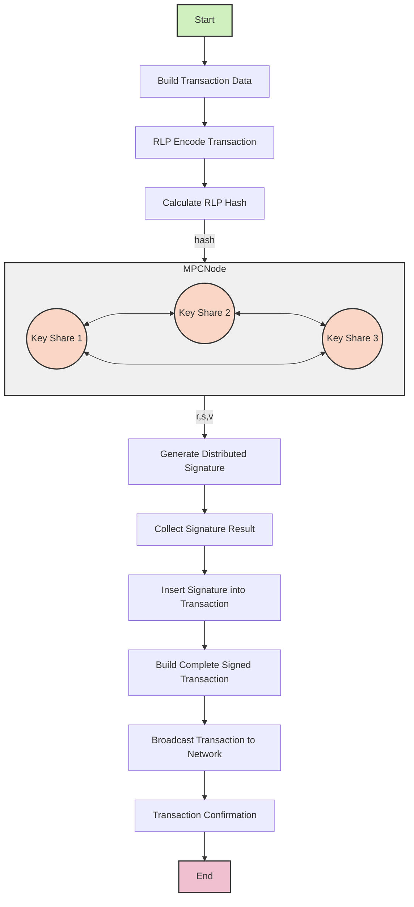

# Binance TSS Demo Project

This project serves as a demonstration for Threshold Signature Scheme (TSS).

## Overview

The TSS Demo Project is designed to showcase the implementation and functionality of threshold signature schemes, which are crucial for enhancing security in distributed systems. This project leverages key technologies and libraries to provide a robust demonstration of TSS capabilities.



## Related Technologies

- [TSS Library](https://github.com/binance-chain/tss-lib): A library that provides the core functionalities for implementing threshold signature schemes.
- [Sygma Core](https://github.com/sygmaprotocol/sygma-core): A protocol that facilitates cross-chain communication and interoperability.

## Code Reference

For a deeper understanding of the implementation, refer to the [Sygma Relayer v2.6.1](https://github.com/sprintertech/sygma-relayer/tree/v2.6.1) repository, which provides additional context and examples.

## Getting Started

To run the TSS Demo Project, execute the following commands in your terminal:

```bash
TSS_CONFIG=config1.json NAME=p1 PORT=8001 go run cmd/server/main.go
TSS_CONFIG=config2.json NAME=p1 PORT=8002 go run cmd/server/main.go
TSS_CONFIG=config3.json NAME=p1 PORT=8003 go run cmd/server/main.go
```

HTTP API: 
- [health.http](test/http/health.http)
- [genkey.http](test/http/genkey.http)
- [sign.http](test/http/sign.http)

Config and API Params Tools:
- [Generate Peer Private Key](https://github.com/myronzhangweb3/binance-tss-demo/blob/cbc42d77af3909b9ba8a82453234b4d10928bbab/cli/generateKey_test.go#L8)
- [Generate Rlp](https://github.com/myronzhangweb3/binance-tss-demo/blob/930fcc797c283f43400907d6cb3966a8f25b277b/test/tx_build/sign_test.go#L10)
- [Generate Broadcast Tx](https://github.com/myronzhangweb3/binance-tss-demo/blob/930fcc797c283f43400907d6cb3966a8f25b277b/test/tx_build/sign_test.go#L35)